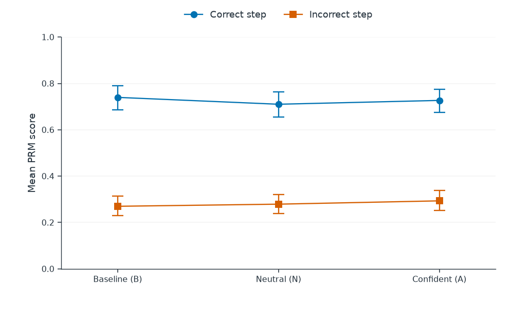
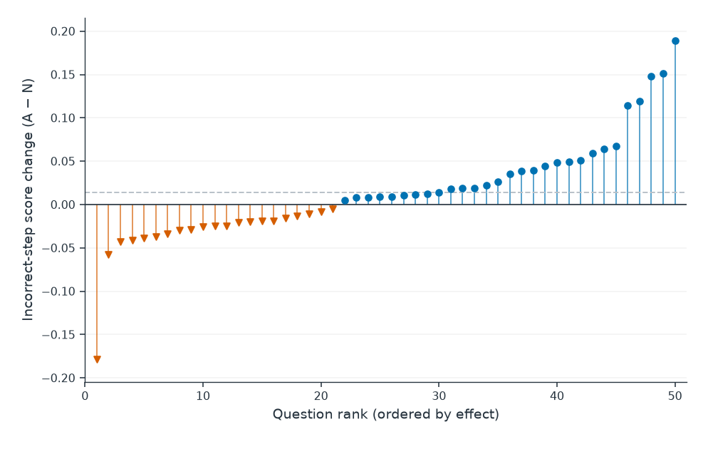
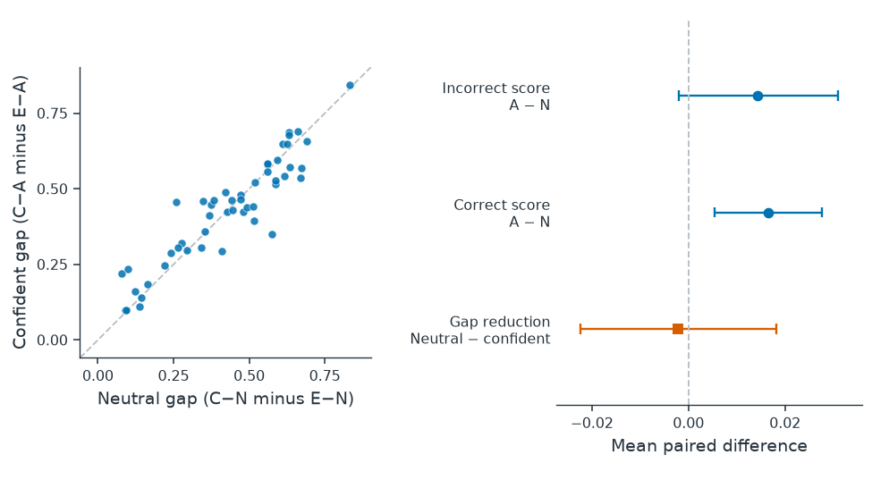

# Confidence Wording and Process Reward Scoring: A Controlled Study of Mathematical Reasoning Steps

A controlled, exploratory study of how fixed confidence wording changes a process reward model's scores for correct and incorrect mathematical steps.

**Repository name:** `prm-wording-sensitivity`  
**Status:** The local experiment and analysis are complete: 5 development questions, 50 formal questions, and 300 formal scored inputs. This is not a claim of publication or peer review.

## Overview

Process reward models (PRMs) assign scores to intermediate reasoning steps. This project tests whether replacing a neutral phrase with a confident phrase changes those scores when the mathematical content and preceding context are held fixed.

Each selected question is converted into a short, correct prefix followed by one target step. The target has a correct version and an incorrect version obtained by changing its integer result from `n` to `n + 1`. Both versions are evaluated under baseline, neutral, and confident wording.

The study evaluates **step-level score sensitivity and correct-minus-incorrect score separation**. It does not measure error severity, downstream answer harm, or complete-solution selection performance. “Controlled” refers to the within-question input construction, not to random sampling or a general causal identification of confidence.

## Research questions

1. Does the fixed confident phrase increase the score of an incorrect step relative to the fixed neutral phrase?
2. Does this replacement narrow the score gap between the correct and incorrect versions of the same step?
3. How do both phrased conditions compare with the original unprefixed target?

The first question is the primary contrast; gap reduction is the secondary contrast. Additional baseline comparisons are exploratory and must not replace the primary comparison after inspecting results.

## Experimental design

### Data and selection

The source is a user-provided 500-row export identified as the `test` split of [HuggingFaceH4/MATH-500](https://huggingface.co/datasets/HuggingFaceH4/MATH-500). Its upstream dataset revision was not supplied or independently matched. Local SHA-256 hashes and source IDs are retained for traceability.

- **Development set:** 5 questions, excluded from formal analysis.
- **Candidate pool:** 132 questions after excluding development IDs and filtering to Algebra, Prealgebra, and Intermediate Algebra, levels 1–3, without `[asy]` diagrams.
- **Formal set:** 50 questions selected purposively for short, unambiguous, non-final integer calculations. Selected questions do not require an external diagram or table.
- **Selection basis:** question and solution content; no PRM scores were used for question selection.
- **Sampling:** manual suitability selection, not random sampling and not a representative MATH-500 benchmark evaluation.

| Formal-set attribute | Count |
| --- | ---: |
| Algebra | 28 |
| Prealgebra | 21 |
| Intermediate Algebra | 1 |
| Level 1 | 14 |
| Level 2 | 26 |
| Level 3 | 10 |

Development question IDs:

```text
test/algebra/1004.json
test/intermediate_algebra/134.json
test/prealgebra/105.json
test/algebra/1265.json
test/algebra/2214.json
```

### Paired step construction

For each formal question:

1. Rewrite or unpack a reference calculation into a correct shared prefix and one intermediate target.
2. Construct a mathematically correct target with integer result `n`.
3. Construct the incorrect target by replacing only that result with `n + 1`.
4. Apply the wording templates to the target only; keep the prefix unchanged.
5. Stop the response immediately after the target. Do not include later reasoning or the reference answer.

The reference solution and answer are retained as metadata for review. **Only `problem` and `response` are supplied to the model.** A step boundary is represented by a newline.

Example from `formal_008`:

```text
Problem:
You have 5 shirts, 6 pairs of pants, and 8 hats. How many outfits can you
make consisting of one shirt, one pair of pants, and one hat?

Shared prefix:
An outfit is determined by a shirt, a pair of pants, and a hat.
First count the combinations of a shirt and a pair of pants.

Correct target:
The number of shirt-pants combinations is 5 * 6 = 30.

Incorrect target:
The number of shirt-pants combinations is 5 * 6 = 31.
```

The example prefix is wrapped above for readability; the stored prefix is a single line.

### Six conditions per question

| Code | Correctness | Target wording |
| --- | --- | --- |
| C-B | Correct | `{step}` |
| C-N | Correct | `For this step, {step}` |
| C-A | Correct | `Without any doubt, {step}` |
| E-B | Incorrect | `{step}` |
| E-N | Incorrect | `For this step, {step}` |
| E-A | Incorrect | `Without any doubt, {step}` |

For N and A, the initial letter of the original target sentence is lowercased. All six conditions share the same question and prefix. A and N have equal input token counts for all 50 questions in this dataset. This controls token count, but does not separate confidence from lexical or stylistic differences.

There are **50 × 2 × 3 = 300 inputs**, with **50 questions as the statistical unit**.

## Model and scoring

- **Model:** [Skywork/Skywork-o1-Open-PRM-Qwen-2.5-1.5B](https://huggingface.co/Skywork/Skywork-o1-Open-PRM-Qwen-2.5-1.5B).
- **Model revision:** `98d69606595eedbdbbbf0a7d28efdcd462ba6a67`.
- **Inference implementation:** [SkyworkAI/skywork-o1-prm-inference](https://github.com/SkyworkAI/skywork-o1-prm-inference).
- **Upstream code commit:** `719b56b17447405e0f10e6c0360a581cf4ffa9c1`.
- **Recorded execution:** Apple Silicon M1, MPS, batch size 1, evaluation mode.
- **Precision:** float16 backbone; float32 value head.
- **Attention:** SDPA; `use_cache=False`.
- **Input limit:** 512 tokens; observed lengths are 52–147 tokens; no truncation.
- **Score:** sigmoid of the scalar reward-head output at the final target-step boundary token, using the upstream input preparation convention.

Scores are treated as model scores. Their calibration as probabilities of correctness has not been established. There is no fine-tuning or generated continuation in this experiment.

## Metrics and statistical analysis

For question `i`, let `s_i(C,N)` be the correct target's score under neutral wording, with analogous notation for other conditions.

```text
Incorrect-step wording effect:
    delta_E(i) = s_i(E,A) - s_i(E,N)

Correct-step wording effect:
    delta_C(i) = s_i(C,A) - s_i(C,N)

Neutral gap:
    gap_N(i) = s_i(C,N) - s_i(E,N)

Confident gap:
    gap_A(i) = s_i(C,A) - s_i(E,A)

Gap reduction:
    reduction(i) = gap_N(i) - gap_A(i)
                 = delta_E(i) - delta_C(i)
```

Positive `delta_E` means that the confident template raises the incorrect step's score. Positive `reduction` means that the confident template narrows correct–incorrect separation relative to the neutral template.

The analysis reports means, medians, standard deviations, directional counts, and **pointwise 95% percentile bootstrap intervals**. It resamples the 50 questions with replacement **20,000 times**, using seed **42** and the same resampling indices for every metric. All six conditions remain paired within a resampled question.

This is an exploratory study, not a preregistered confirmatory test. Intervals are not adjusted for multiple comparisons. Bootstrap uncertainty does not correct purposive selection bias. An interval containing zero is not evidence of equivalence or absence of an effect.

## Results

### Mean scores

| Target | Baseline B | Neutral N | Confident A |
| --- | ---: | ---: | ---: |
| Correct | 0.7398 | 0.7102 | 0.7267 |
| Incorrect | 0.2699 | 0.2791 | 0.2934 |
| Correct − incorrect | 0.4699 | 0.4311 | 0.4333 |

### Paired contrasts

| Contrast | Mean | 95% paired-bootstrap interval |
| --- | ---: | --- |
| Incorrect-step effect: E-A − E-N | +0.014320 | [-0.001933, +0.031023] |
| Correct-step effect: C-A − C-N | +0.016526 | [+0.005497, +0.027639] |
| Gap reduction: neutral − confident | -0.002206 | [-0.022341, +0.018261] |

- The incorrect-step score increased in **29/50** questions and decreased in **21/50**.
- The incorrect-step mean effect and the gap-reduction interval both include zero. The current sample does not establish a stable incorrect-step increase or a narrowing of separation for **A versus N**.
- Correct-step scores also increased on average. An increase in incorrect-step scores alone therefore does not establish poorer discrimination.
- Correct targets outscored their paired incorrect targets in all 50 questions under each wording condition. There were no ranking inversions or ties. This is **within-question ranking**, not 100% threshold-based classification accuracy.

### Exploratory baseline comparisons

Post hoc checks during the project audit found that both neutral and confident wording narrowed the mean gap relative to baseline:

| Comparison | Mean gap reduction | Pointwise 95% bootstrap interval |
| --- | ---: | --- |
| Baseline → neutral | +0.038817 | [+0.022964, +0.054523] |
| Baseline → confident | +0.036611 | [+0.020343, +0.054024] |

These comparisons are exploratory, unadjusted, and distinct from the primary A-versus-N contrast. The results do **not** justify the broad statement that wording has no effect. They also do not establish a general causal effect of confidence.

**Main interpretation:** the tested PRM is sensitive to target wording, but this controlled sample does not establish additional deterioration in correct–incorrect separation when the chosen confident phrase replaces the chosen neutral phrase.

## Figures

Figure titles and explanatory notes are kept outside the artwork for manuscript use. PDF and SVG exports are vector formats; full PNG exports are 600 dpi at approximately 180 mm width. The previews below are lighter files for browsing. Target-journal formatting may require further size adjustments.

### Figure 1 — Condition-level scores



Points show question-level means; whiskers show pointwise 95% bootstrap intervals. Use paired contrasts, not overlap of these marginal intervals, to assess differences.

[PDF](results/formal_analysis/figure_1_condition_scores.pdf) · [SVG](results/formal_analysis/figure_1_condition_scores.svg) · [600 dpi PNG](results/formal_analysis/figure_1_condition_scores.png)

### Figure 2 — Question-level incorrect-step effects



Each point is one question, sorted by `E-A − E-N` for display only. The dashed line is the mean; all 50 questions are retained. [Rank-to-question mapping](results/formal_analysis/figure_2_rank_mapping.csv).

[PDF](results/formal_analysis/figure_2_question_effects.pdf) · [SVG](results/formal_analysis/figure_2_question_effects.svg) · [600 dpi PNG](results/formal_analysis/figure_2_question_effects.png)

### Figure 3 — Score gaps and paired contrasts



Left: neutral versus confident score gaps, with an equality reference line. Right: mean paired differences and pointwise 95% bootstrap intervals. Positive gap reduction means narrower separation under confident wording.

[PDF](results/formal_analysis/figure_3_gap_robustness.pdf) · [SVG](results/formal_analysis/figure_3_gap_robustness.svg) · [600 dpi PNG](results/formal_analysis/figure_3_gap_robustness.png)

## Repository structure

```text
.
├── README.md
├── requirements-prm.txt          # Model dependencies; PyTorch installed separately
├── test.jsonl                    # Local 500-question source export
├── smoke_test_prm.py             # Initial two-case execution check
├── six_variant_demo.py           # Handwritten six-condition demonstration
├── run_dev_prm.py                # Five-question development experiment
├── build_formal_50.py            # Constructs 50 pairs and 300 variants
├── run_formal_prm.py             # Formal scoring with automatic resumption
├── analyze_formal_prm.py         # Paired statistics, tables, and figures
├── audit_project.py              # Independent local artifact/statistics checks
├── skywork-o1-prm-inference/      # External dependency at the recorded commit
├── data/
│   ├── dev_5.jsonl
│   ├── dev_5_variants.jsonl
│   ├── formal_50_source.jsonl
│   ├── formal_50_selection.jsonl
│   ├── formal_50.jsonl
│   ├── formal_50_variants.jsonl
│   ├── formal_50_manifest.json
│   ├── formal_50_construction_manifest.json
│   └── formal_50_constructed_review.md
└── results/
    ├── formal_50_scores.json
    ├── formal_analysis/          # Statistics, report, and figure exports
    └── project_audit/            # Audit evidence and runtime spot check
```

Selection and construction manifests are historical stage records. The selection manifest's next-step notes do not indicate that the subsequently completed scoring run is unfinished. Some earlier review documents are in Chinese; experimental inputs, code, and this README are in English.

## Reproduce the analysis from saved scores

Run commands from the repository root. This route does **not** need model weights, PyTorch, MPS, or a model download; it does need the retained formal data, development IDs, and saved scores for validation.

With Python 3.11 available:

```bash
python -m pip install "numpy==2.4.6" "matplotlib==3.11.2"
python analyze_formal_prm.py
```

The listed versions are the observed working versions, not a claim that a clean installation on every platform has been validated. The project model-dependency file does not include matplotlib; install it explicitly for analysis.

An optional separate analysis directory:

```bash
python analyze_formal_prm.py --seed 42 --bootstrap 20000 --output-dir results/formal_analysis_reproduced
```

Outputs include:

- `analysis_summary.json`: numeric results, method settings, software versions, and hashes.
- `condition_statistics.csv`: means and intervals for the six conditions.
- `paired_statistics.csv`: eight paired metrics.
- `question_statistics.csv`: six scores and paired metrics for every question.
- `figure_2_rank_mapping.csv`: display ranks mapped to source questions.
- `analysis_report.md`: interpretation, limitations, English captions, and illustrative cases.
- Three figures in PDF, SVG, 600 dpi PNG, and preview PNG formats.

Running with the default output directory regenerates the analysis artifacts; it does not modify the saved model scores.

## Reproduce model scoring

The supplied scoring scripts target **Apple Silicon MPS** and use `fcntl` for checkpoint locking. A CUDA/CPU port is not included or validated.

### 1. Prepare an environment

If the working `prm-study` environment already exists, activate it. Otherwise, an example starting setup is:

```bash
conda create -n prm-study python=3.11
conda activate prm-study
python -m pip install "torch==2.14.0"
python -m pip install -r requirements-prm.txt
python -m pip install "numpy==2.4.6" "matplotlib==3.11.2"
```

The broad ranges in `requirements-prm.txt` are not a full environment lock. The versions actually recorded by the audit are:

| Component | Recorded version |
| --- | --- |
| Python | 3.11.16 |
| torch | 2.14.0 |
| transformers | 4.46.3 |
| accelerate | 1.15.0 |
| huggingface-hub | 0.36.2 |
| safetensors | 0.8.0 |
| numpy | 2.4.6 |
| matplotlib | 3.11.2 |
| tokenizers | 0.20.3 |

MPS availability can be checked with:

```bash
python -c "import torch; print('MPS available:', torch.backends.mps.is_available())"
```

### 2. Obtain the upstream inference code

If `skywork-o1-prm-inference/` is not already populated:

```bash
git clone https://github.com/SkyworkAI/skywork-o1-prm-inference.git
git -C skywork-o1-prm-inference checkout 719b56b17447405e0f10e6c0360a581cf4ffa9c1
```

This is an external repository dependency; an empty directory or a nested Git reference without its contents is not sufficient to run the scripts.

### 3. Cache the fixed model revision

The formal runner uses the local Hugging Face cache and does not download missing weights. If the revision is not cached, download it once while connected:

```bash
python - <<'PYTHON'
from huggingface_hub import snapshot_download

snapshot_download(
    repo_id="Skywork/Skywork-o1-Open-PRM-Qwen-2.5-1.5B",
    revision="98d69606595eedbdbbbf0a7d28efdcd462ba6a67",
)
PYTHON
```

The model weights are several gigabytes and are an external dependency, not a required Git-tracked artifact.

### 4. Validate inputs

```bash
python run_formal_prm.py --preview
python run_formal_prm.py --check-inputs
```

The first command validates the frozen data and templates. The second reconstructs token lengths and scoring boundaries using the cached tokenizer, without loading model weights.

The formal inputs are already included. `build_formal_50.py --check-inputs` is available to reconstruct them in the recorded environment; it rejects differing existing outputs unless `--overwrite` is explicitly supplied. Rebuilding is not required to reproduce scoring, and revised inputs must be treated as a separate experiment.

### 5. Score a new run

To retain the distributed scores and produce a separate replication:

```bash
python run_formal_prm.py --output results/formal_50_scores_replication.json
```

The model is loaded once, inputs are scored individually, and each completed result is saved atomically. Rerun the **same command** to resume after interruption. Data, code, and environment fingerprints must match the checkpoint. A complete checkpoint is not rescored. Different hardware or library versions may yield small numerical differences.

To analyze the replication separately:

```bash
python analyze_formal_prm.py --input results/formal_50_scores_replication.json --output-dir results/formal_analysis_replication
```

### 6. Audit the retained experiment

```bash
python audit_project.py
```

This audit requires the model environment, upstream code, and cached tokenizer, but does not load model weights. It checks the original retained `formal_50_scores.json`, verifies its source/code hashes, reconstructs all token boundaries, and independently recomputes the recorded statistics. It writes to `results/project_audit/` and expects the main analysis artifacts to be present.

The development workflow is retained in `run_dev_prm.py`. The apple smoke test and six-variant demo are debugging examples and are excluded from formal statistics. The historical smoke/demo download paths do not pin the model revision in the same way as the formal runner; use the fixed-revision formal workflow for research replication.

## Validation and audit

The project audit found:

- 500 unique source IDs and 50 selected source records matching the local export.
- Zero development/formal ID overlap.
- 50 verified target calculations and 50 single-integer error edits.
- 300 reconstructed token boundaries consistent with saved scoring metadata.
- Identical shared-prefix scores across all six conditions for each question.
- Agreement between independent recomputation and all eight reported paired metrics and their bootstrap intervals.
- Value-head parameters matching the cached checkpoint and six independently rerun scores matching the saved values exactly.

The runtime check is a **six-input spot check**, not a complete rerun of 300 scores. The formal constructions were reviewed by the assistant; independent human double annotation was not recorded. The audit did not certify the upstream dataset revision, training-data non-overlap, all third-party dependencies, or a clean-environment installation.

See [audit evidence](results/project_audit/audit_evidence.json), [runtime spot-check results](results/project_audit/runtime_spotcheck.json), and the [detailed project review](results/project_audit/project_audit_report.md).

## Limitations

1. **One model and one phrase pair.** The result concerns a specific template replacement, not confidence wording in general.
2. **Purposive, small sample.** The 50 questions are not representative of the full benchmark. Question-level bootstrap intervals do not remove selection bias or establish benchmark-wide coverage.
3. **Artificial local errors.** A fixed `+1` corruption does not represent all arithmetic, logical, or natural model-generated errors. Equal absolute changes do not imply equal error severity.
4. **Adapted reasoning steps.** Short manually constructed prefixes and targets differ from complete generated solutions. Three pairs of questions reuse the same target arithmetic expression in different contexts.
5. **No downstream harm measurement.** Score shifts and score gaps are not direct measurements of final-answer accuracy or best-of-N selection quality.
6. **No calibration or equivalence claim.** Sigmoid scores are not validated correctness probabilities; intervals crossing zero do not prove no effect. No ranking inversions does not imply perfect classification.
7. **Incomplete external provenance.** The exact upstream dataset revision and possible model-training overlap remain unverified.
8. **Exploratory inference.** The study is not preregistered; reported intervals are pointwise and unadjusted for multiple comparisons. Post hoc baseline checks are explicitly separated from the original contrasts.

## Possible extensions

- Predefine several neutral and confident templates and a question-level aggregation rule before collecting new scores.
- Add other error types while keeping single-edit paired construction where possible.
- Replicate on another PRM and a broader, prespecified question sample.
- Evaluate downstream answer selection only if making claims about practical harm.

Extensions should be recorded as new experiments. The original formal set and results should remain available, including null or mixed findings.

## Authors

Binheng Zheng (Heidelberg University)
